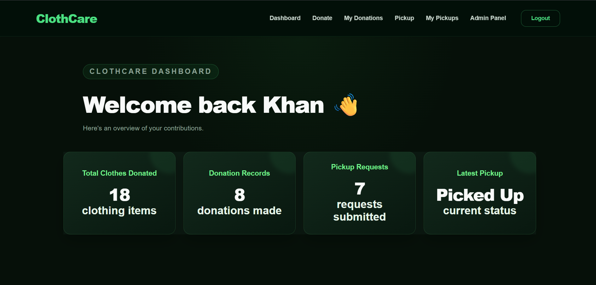
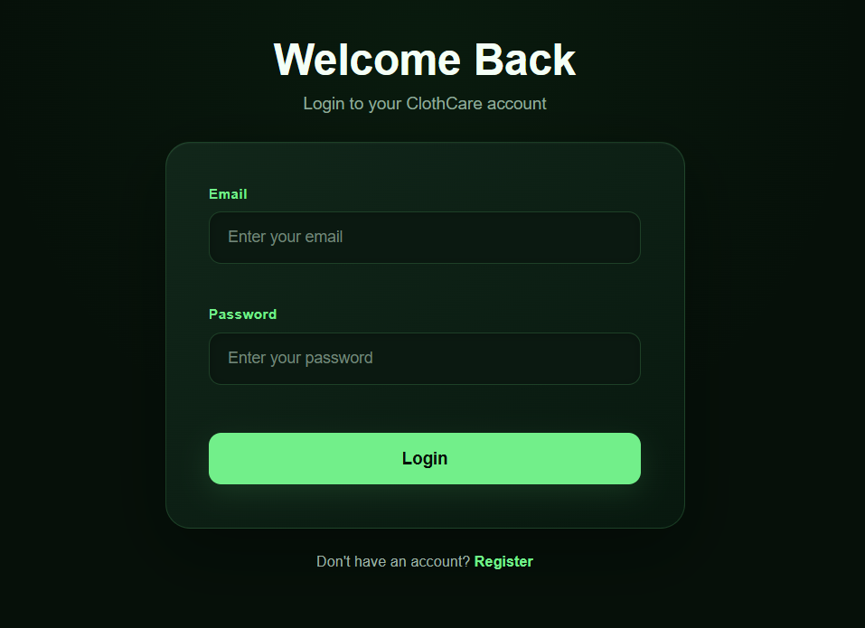
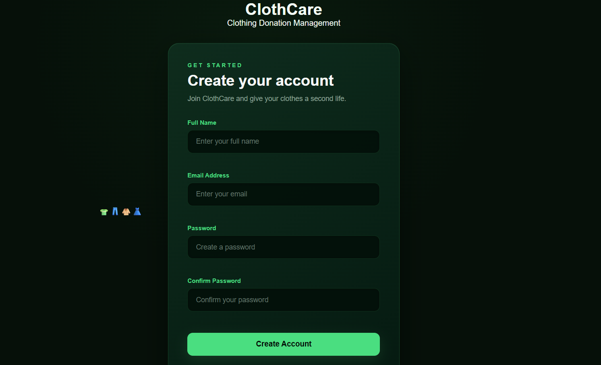

# ClothCare – Clothing Donation Management System

ClothCare is a web-based Clothing Donation Management System that allows users to register, donate clothes, request pickups, track donations and pickups, while administrators can manage users, donations, pickups and clothing distribution.

## Live Website

https://cloth-care-nine.vercel.app

## Technologies Used

### Frontend
- React.js
- Vite
- HTML
- CSS
- JavaScript
- Vercel

### Backend
- Node.js
- Express.js
- REST API
- Render

### Database
- MySQL-compatible TiDB Cloud
- MySQL
- Database: `clothcare`

### Source Code
- GitHub

## Deployment

| Component | Platform |
|---|---|
| Frontend | Vercel |
| Backend | Render |
| Database | TiDB Cloud |
| Source Code | GitHub |

## System Architecture

User → Vercel Frontend → Render Backend → TiDB Cloud Database

## Team Members

| Reg No. | Name | Contribution |
|---|---|---|
| 14 | Faiz Khan | Frontend Development |
| 24 | Mohammed Fuzail | Database |
| 44 | Syed Jafer | Backend Development |
| 54 | Yeshwanth R | Backend Development |

## Main Features

- User Registration
- User Login
- User Dashboard
- Clothing Donation
- Donation Records
- Pickup Requests
- Pickup Tracking
- Admin Dashboard
- User Management
- Donation Management
- Pickup Management
- Clothing Distribution Management

## Screenshots

### Home Page


### User Dashboard


### Donate Clothes


### My Donations


### Request Pickup


### My Pickups


### Login


### Register


### Admin Dashboard


### Admin Users


### All Donations


### Pickup Requests


### Manage Distribution


## Project Structure

```text
ClothCare-Final/
├── frontend/
├── backend/
├── database.sql
├── screenshots/
├── .gitignore
├── package.json
└── README.md
